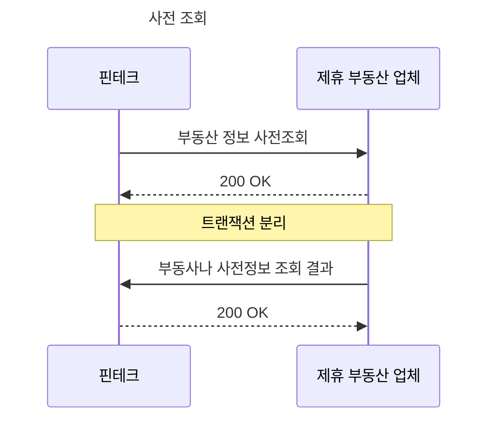
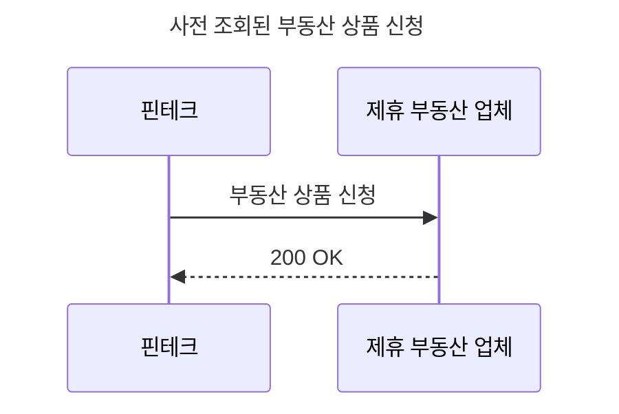

# 🏘️ Real Estate 연계 서비스

## 개요

- 부동산 정보 제공 서비스와 연계하여 부동산 정보를 제공하는 서비스 구현

## 서버 구성

- 핀테크 어플리케이션(웹)
- 핀테크 서비스(핀테크 서버)
- 부동산 정보 제공 서비스(제휴 부동산 서버)

## 기술 스택

- Spring Boot 3
  - Spring Web
  - Spring WebFlux(HTTP Interface)
  - Spring Data JDBC
  - h2 Database
- NextJS(예정)
  - TailwindCSS

## 📋 TODO LIST

- [x] 부동산 사전조회 API
- [x] 부동산 사전조회 결과 API
- [x] 부동산 상품 신청 API
- [ ] OAuth2
- [ ] 개인정보 암호화
- [ ] 핀테크 어플리케이션 구현(NextJS)

## 흐름도

## 실행

- estate-service 실행(8080)
- fintech-service 실행(8081)

## 테스트

- `inquery.http` 파일 참고(`Intellij`에서 `Rest Client` 플러그인 설치 필요)